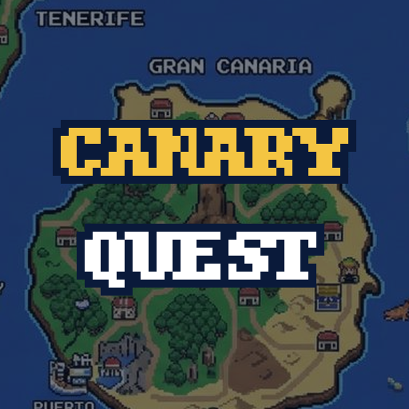

<p align="center">
  
</p>

<h1 align="center">CanaryQuest</h1>

<p align="center">
  <strong>RPG pixel-art de las Islas Canarias para navegador y móvil, al estilo Zelda de SNES.</strong>
</p>

<p align="center">
  <a href="https://erseco.github.io/CanaryQuest/"></a>
</p>

<p align="center">
  <a href="https://github.com/erseco/CanaryQuest/actions/workflows/ci.yml"></a>
  <a href="LICENSE"></a>
  
  
</p>

---

Recorre las islas, entra en sus pueblos, bosques, volcanes y desiertos, consigue
la espada y resuelve la misión de cada isla para reunir los **8 símbolos
guanches** que despiertan al espíritu del Teide. Viaja entre islas en **ferry**
o en **avión de Binter** desde el puerto o el aeropuerto.

## Qué hay ya

| Isla | Zonas | Misión |
|---|---|---|
| Gran Canaria | Pinar del Roque Nublo, casa-cueva, dunas de Maspalomas, Las Palmas, La Isleta | Las culebras del pinar · El rebaño del Roque Nublo |
| Lanzarote | Montañas del Fuego (Timanfaya), Jameos del Agua | El agua de los Jameos |
| La Gomera | Bosque de laurisilva de Garajonay (con niebla) | El silbo del bosque |
| Fuerteventura | Betancuria y el malpaís | El queso majorero robado |
| Tenerife, La Palma, El Hierro | Visitables en el mapa | Próximamente |

Combate con espada, enemigos que reaparecen al volver a entrar en un mapa y
sueltan corazones, cofres, contenedores de corazón y guardado automático. Los
diálogos cuentan cosas reales de cada sitio (el jameíto ciego, el silbo gomero,
la culebra real invasora…).

## Controles

| Acción | Teclado | Móvil |
|---|---|---|
| Moverse | Flechas / WASD, o clic donde ir | Pad virtual o tocar donde ir |
| Atacar | `ESPACIO` | Botón ⚔ |
| Hablar / abrir / entrar | `E` o `ENTER` | Tocar al personaje |
| Menú (guardar, ayuda, ajustes, reiniciar) | `ESC` | Botón ☰ |

## Desarrollo

```bash
npm install
npm run dev        # servidor de desarrollo (Vite) → http://localhost:5173
npm test           # tests unitarios (Vitest)
npm run lint       # ESLint
npm run build      # type-check + build estático en dist/
```

`make help` lista los atajos. Añade `?debug=1` a la URL para ver las colisiones
de las islas.

Cada push a `main` pasa lint, tests y build en GitHub Actions y se publica en
**GitHub Pages**. El build es 100 % estático y funciona en cualquier hosting
(`make package` genera un zip listo para itch.io).

Stack: **Phaser 4 + TypeScript estricto + Vite**, mapas de [Tiled](https://www.mapeditor.org)
a 32 px. Los mapas grandes se generan con los scripts de `scripts/` y siguen
siendo editables en Tiled.

## Documentación

- [`AGENTS.md`](AGENTS.md): guía rápida para colaboradores y agentes.
- [`docs/arquitectura.md`](docs/arquitectura.md): escenas, sistemas y eventos.
- [`docs/decisiones.md`](docs/decisiones.md): por qué Phaser, 32 px, mapas híbridos… (ADRs).
- [`docs/como-anadir-contenido.md`](docs/como-anadir-contenido.md): nueva misión, zona o isla.
- [`docs/creditos.md`](docs/creditos.md): origen y licencia de cada asset.

## Licencia y créditos

Código bajo **GPL-3.0**. Los assets de terceros son libres y compatibles:
terrenos y árboles de [Liberated Pixel Cup](https://opengameart.org/content/liberated-pixel-cup-lpc-base-assets-sprites-map-tiles)
(CC-BY-SA 3.0 / GPL 3.0), música, sonidos, enemigos y NPCs de
[BrowserQuest](https://github.com/mozilla/BrowserQuest) (CC-BY-SA 3.0) y tiles
del proyecto [Tuxemon](https://github.com/Tuxemon/Tuxemon) (CC-BY-SA 4.0). Las
ilustraciones de las islas y los tilesets de PixelLab son propios. Detalle
completo en [`docs/creditos.md`](docs/creditos.md).
